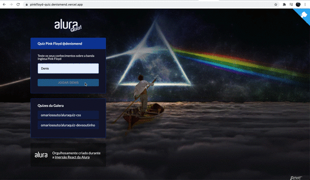

<p align="center">
   
</p>

<p align="center">	
   <a href="https://linkedin.com/in/denis-ladeira-814365115/">
      
   </a>
  

  <a aria-label="Completed" href="https://nextlevelweek.com/episodios/omnistack/edicao/2">
    </img>
  </a>
  <a href="https://github.com/denismend/nlw-02-proffy/commits/master">
    
  </a> 
  
</p>

<p align="center">
   :rocket: Project made to connect people in general and orphanages to visit, made in Next Level Week #3 @Rocketseat
</p>

<div align="center">
  <sub>The NLW #3 Proffy project. Built with ❤︎ by
    <a href="https://github.com/denismend">Denis Ladeira</a> and
    <a href="https://github.com/denismend/pinkfloyd-quiz/graphs/contributors">
      contributors
    </a>
  </sub>
</div>


<p align="center">
  
</p>

# :pushpin: Table of Contents

* [Technologies](#computer-technologies)
* [Features](#rocket-features)
* [How to Run](#construction_worker-how-to-run)
* [Found a bug? Missing a specific feature?](#bug-issues)
* [Contributing](#tada-contributing)
* [License](#closed_book-license)

# :computer: Technologies
This project was made using the follow technologies:

* [Typescript](https://www.typescriptlang.org/)      
* [React](https://reactjs.org/)      
* [Expo](https://expo.io/)       
* [Express](https://expressjs.com/)      

# :rocket: Features

* Website to sign up teachers and students.
* App to connect teachers and students.

# :construction_worker: How to run
```bash
# Clone Repository
$ git clone https://github.com/denismend/pinkfloyd-quiz.git
```
# :construction_worker: How we create project:

Execute [`create-next-app`](https://github.com/vercel/next.js/tree/canary/packages/create-next-app) with [npm](https://docs.npmjs.com/cli/init) or [Yarn](https://yarnpkg.com/lang/en/docs/cli/create/) to bootstrap the example:

```bash
npx create-next-app --example with-styled-components with-styled-components-app
# or
yarn create next-app --example with-styled-components with-styled-components-app
```
### 💻 Run Project

```bash
# Go to web folder
$ cd pinkfloyd-quiz

# Install Dependencies
$ yarn install

# Run Aplication
$ yarn dev
```
Go to http://localhost:3000/ to see the result.

# :bug: Issues

Feel free to **file a new issue** with a respective title and description on the the [Proffy](https://github.com/denismend/pinkfloyd-quiz/issues) repository. If you already found a solution to your problem, **i would love to review your pull request**!

# :tada: Contributing

There are many forms to contribute with the project, first of all you can give this github repo a Star.

If you want do help with the code follow the steps bellow

```ps
# Fork using GitHub official command line
# If you don't have the GitHub CLI, use the web site to do that.
$ gh repo fork denismend/pinkfloyd-quiz

# Clone your fork
$ git clone {your-fork-url}
$ cd proffy

# Create a branch with your feature
$ git checkout -b {branch-name}

# Make the commit with your changes
$ git commit -m 'Feat: {feature-name}'

# Send the code to your remote branch
$ git push origin {branch-name}
```

# :closed_book: License

Released in 2021 :closed_book: License

Made with love by [Denis Ladeira](https://github.com/denismend) 🚀.
This project is under the [MIT license](./LICENSE).


Give a ⭐️ if this project helped you!